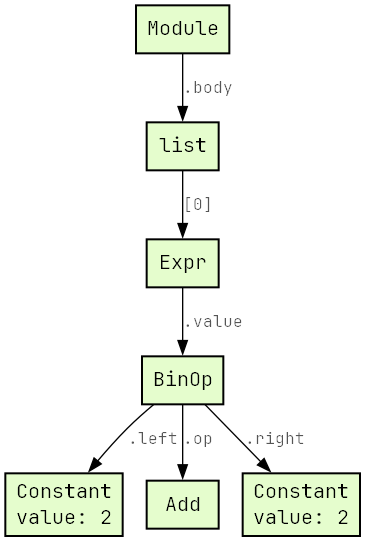
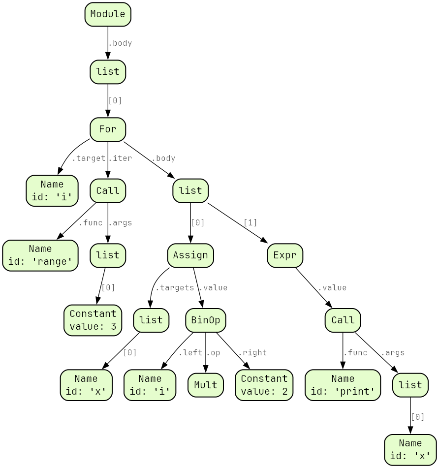

# astdot

Simple Python AST visualizer

Examples:

```Python
import astdot

print(astdot.source_to_dot('2 + 2'))
```




```Python
import astdot


def skip_ctx(name, value):
    return astdot.skip(name, value) or name == 'ctx'


src = '''
for i in range(3):
    x  = i * 2
    print(x)
'''

ROUNDED = astdot.STY + 'node [style="filled,rounded"]'
print(astdot.source_to_dot(src, skip=skip_ctx, style=ROUNDED))
```


